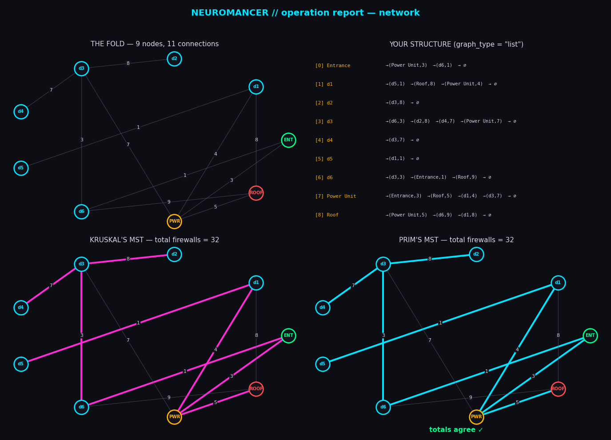
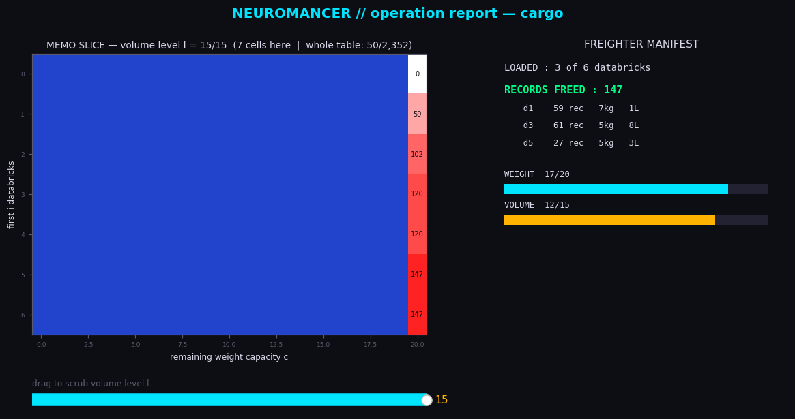

# Neuromancer: Hacking with Graphs

**Course:** Algorithms and Analysis — COSC2123/3119
**University:** RMIT University

---

## Overview

Neo-Meridian, 2157. This assignment models **The Fold** — the Monarch's data
storage facility — as a weighted undirected graph. Nodes are databricks (plus
the Entrance, the Power Unit, and the Roof); every connection is protected by
a number of firewalls, which is that connection's weight. You will implement
an efficient graph representation, compute minimum spanning trees, analyse
your tools in theory and by experiment, and decide which databricks to load
onto the getaway freighter. Full details are in the assignment specification
PDF — this README covers how to *run* everything.

## Tasks

| Task | Marks | File to edit | Local tests |
|------|-------|--------------|-------------|
| **A** | 5 | `graph/adjacency_list.py` | `python -m tests.task_a` |
| **B** | 7 | `mst/kruskals.py` | `python -m tests.task_b` |
| **C** | 8 | `initiateOperation.py` (experiments; report only) | — |
| **D** | 10 | `cargo/load_freighter.py` | `python -m tests.task_d` |

Only edit files whose header says `EDIT THIS FILE`. Everything else is
replaced with a clean copy during marking, so changes elsewhere will not
exist when your work is assessed.

## Installation

1. **Python 3.13 or higher** is required — the program checks and refuses
   to run otherwise. Check yours with `python --version`
   (on some systems the command is `python3` or `py -3.13`).

2. From the repository root, create and activate a virtual environment:

   ```bash
   # macOS / Linux
   python3 -m venv .venv
   source .venv/bin/activate

   # Windows (PowerShell)
   py -3.13 -m venv .venv
   .venv\Scripts\Activate.ps1
   ```

3. Install the required packages:

   ```bash
   pip install -r requirements.txt
   ```

4. Verify everything works:

   ```bash
   python -m tests.task_a
   python initiateOperation.py example_config.json
   ```

> **Note on the interactive slider (Task D).** The operation report's
> volume slider needs an *interactive* matplotlib window. On most
> Windows/macOS installs this works out of the box. On Linux you may need
> tkinter (`sudo apt install python3-tk`), and on WSL you need WSLg or an
> X server. Without a display the reports are still **saved as PNGs** —
> you just cannot drag the slider, so use a machine with a display when
> debugging the 3D memo table.

## Running the operation

```bash
python initiateOperation.py example_config.json
```

Two configuration files ship with the skeleton:

* **`spec_config.json`** --- a small, seeded network (9 nodes) that
  reproduces the example shown in this README. Run it to check your code
  produces the same operation report, node for node.
* **`example_config.json`** --- a larger, more realistic setup for general
  use.

You are free to edit either file, or write your own, to test and debug
your code and to run your Task~C experiments. Because every network is
seeded, the same config always produces the same network --- change the
`seed` to get a different one.

## Running the local tests

```bash
python -m tests.task_a
python -m tests.task_b
python -m tests.task_d
```

> **The local tests are NOT exhaustive.** They confirm you are on the right
> track and nothing more. The marking suite is far more rigorous and
> deliberately includes awkward cases the local tests leave out — passing
> every local test does **not** mean full marks will be awarded. Write and
> run your own tests as well.

## Configuration file

JSON cannot hold comments, so every key is documented here (and in
`utils/config_validator.py`, which produces descriptive errors).

| Key | Meaning |
|-----|---------|
| `seed` | Integer. Seeds the random generator so runs repeat exactly. |
| `num_databricks` | Integer ≥ 1. Databrick nodes; the Entrance, Power Unit and Roof are added on top. |
| `num_edges` | Integer. The exact number of connections; must lie between \|V\|−1 and \|V\|(\|V\|−1)/2, where \|V\| = `num_databricks` + 3. The program prints the resulting density d = \|E\|/(\|V\|(\|V\|−1)/2) when it builds the network. |
| `max_firewalls` | Integer ≥ 1. Firewall counts are drawn uniformly from 1..max. |
| `records_range` | `[low, high]` records stored per databrick (its value). |
| `brick_weight_range` | `[low, high]` databrick weight in kilograms. |
| `brick_volume_range` | `[low, high]` databrick volume in litres. |
| `graph_type` | `"list"` or `"matrix"` — which representation to use everywhere. |
| `mst_solver` | `"prims"` or `"kruskals"`. |
| `run_loader` | `true`/`false` — whether to run the freighter loader at all. |
| `loader` | `"brute_force"` (the given baseline) or `"task_d"` (your Task D solution). |
| `weight_capacity` | Integer ≥ 0. The freighter's weight limit (kg). |
| `volume_capacity` | Integer ≥ 0, **or `null` to switch the volume limit off**. |
| `visualise` | `true`/`false` — open and save the operation report. |
| `visual_filename` | Base name for the saved report images (in `visuals/`). |
| `print_struct` | `true` prints the graph structure to the console. |

### Testing each task

The shipped `example_config.json` is set to the **provided** code, so it
runs end to end before you implement anything. To exercise your own code
for a task, flip the relevant key:

| Task | Key | Provided → Yours | What it tests |
|------|-----|------------------|---------------|
| **A** | `graph_type` | `"matrix"` → `"list"` | Runs the whole pipeline on your adjacency list instead of the given matrix. |
| **B** | `mst_solver` | `"prims"` → `"kruskals"` | Finds the safe path with your Kruskal's instead of the given Prim's. Run both and check the totals match. |
| **C** | `visualise` | `true` → `false` | Task C is about timing, not the report. Turn the report off and add your own timing in `initiateOperation.py` (the one file you may edit for Task C). |
| **D** | `loader` | `"brute_force"` → `"task_d"` | Uses your loader instead of the slow brute-force baseline. Set `volume_capacity` to `null` for the single-limit case, or a number for both limits. |

Leave the other keys as they are, or change them freely to test your code
on different networks (change `seed` for a different random one).

## Visualisation — the Operation Report

Setting `"visualise": true` opens the **operation report**: windows that show
what your code actually built. Use them constantly — most bugs in this
assignment are visible before you write a single print statement. Each report
is also saved as a PNG under `visuals/`.

### Report 1 — Network (`<visual_filename>_network.png`)



| Panel | What it shows | What to look for |
|---|---|---|
| **The Fold** | The generated network; Entrance (green), Power Unit (amber), Roof (red), databricks (cyan); firewall labels on connections. | Does it match your config? Is it connected? |
| **Your structure** | Your representation, drawn from *your* code via the graph interface. | Compare edge by edge against the network. A missing back-connection or wrong firewall count stands out immediately. |
| **Kruskal's MST** | Your Task B output highlighted, with its firewall total. | Spans every node with \|V\|−1 connections. |
| **Prim's MST** | The provided reference, with its total. | **The totals must always agree.** The edge *sets* may differ when firewall counts repeat — that is fine. Different totals mean a bug in your Kruskal's. |

### Report 2 — Cargo (`<visual_filename>_cargo.png`)



* **Memo table** (left): every sub-problem your loader computed. Colour runs
  white → red with increasing value; **blue cells were never computed**.
  Small tables show the numbers; large tables switch to a pure heatmap.
* **Freighter manifest** (right): what you loaded, records freed, and gauges
  for the limits. An overflowing gauge turns red — your load is invalid.
* **The slider** (dual-limit runs only): with `volume_capacity` set to a
  number your memo table is three-dimensional — one layer per volume level —
  and a 2D picture can only show one layer at a time. **Drag the slider to
  scrub through the volume levels** and watch which sub-problems your code
  computed at each level. The title reports the cell count at the current
  level and for the whole table. With `"volume_capacity": null` the table is
  2D and no slider appears.

#### What you will see as your Task D progresses

The skeleton ships with `"loader": "brute_force"`, because your own loader
does not exist yet. The cargo report grows with your solution:

| Stage | Config | Cargo report shows |
|---|---|---|
| Fresh clone | `"loader": "brute_force"` | Manifest and gauges only — the baseline keeps no memo table, so that panel just points you back here. |
| Single-limit loader working | `"loader": "task_d"`, `"volume_capacity": null` | Your 2D memo table appears (numbers, or a heatmap when large). No slider — there is only one layer. |
| Dual-limit loader working | `"loader": "task_d"`, `"volume_capacity"` set to a number | The full 3D experience: memo slices, the volume slider, and the volume gauge. |

Running both loaders on the *same small haul* is also a debugging tool: if
their records-freed or total-weight numbers ever differ, your loader has a
bug.

> **Saved PNG caveat:** the slider only works in the live window. The saved
> file captures a single volume level, so when comparing runs or asking for
> help, quote the *whole-table* computed-cell count from the panel title
> rather than judging the saved picture alone.

## Repository map

```
initiateOperation.py     main script (edit for Task C experiments only)
example_config.json      a sensible default configuration
spec_config.json         builds the Figure 2 network from the specification
graph/                   vertices, edges, and the two representations (Task A)
mst/                     Prim's, Kruskal's, merge sort, union-find (Task B)
fold/                    The Fold generator and the Databrick class
cargo/                   the freighter loaders (Task D)
utils/                   config validation, timing, the operation report
tests/                   local (non-exhaustive!) test scripts
visuals/                 saved operation reports appear here
```
